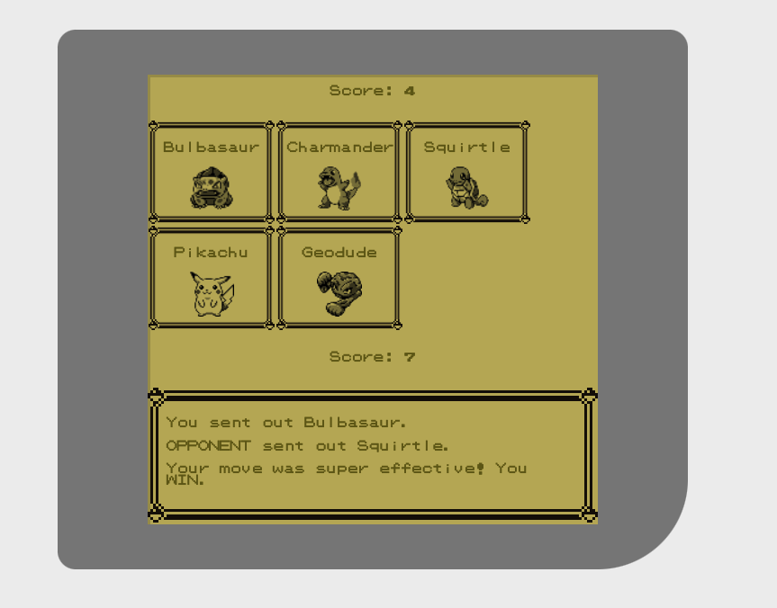

# rockpaperscissors
An interactive rock paper scissors game

This game features a pokemon theme.
To install, clone this repo and open the index.html in your browser.

Click on a button to choose what mode you would like to play, then the pokemon you choose for your attack. Like Rock Paper Scissors, some choices defeat some other choices, and are defeated by some choices.

This project used HTML, CSS, and Javascript. I used Object Oriented Programming with ES6 classes, and separated concerns between a data model and the DOM. I attempted to place most or all DOM-related activities in the View file. I did not begin with the structure of the final version of the app. Instead, I began by writing the simplest code I possibly could, a version of rock-paper-scissors that operated through the console, and iterated to gradually more complex versions of the app with each release.
